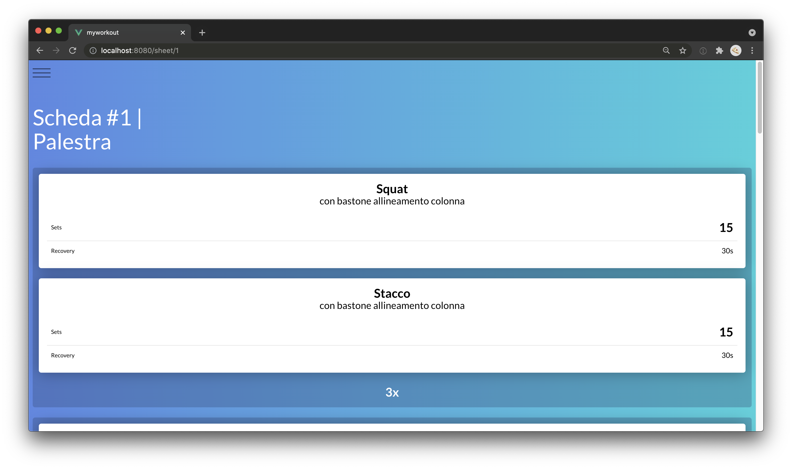
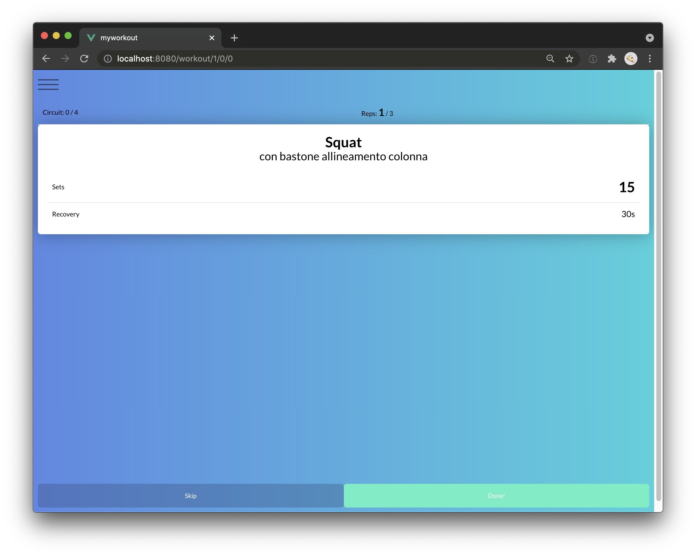

# My workout

I workout at the gym and this project helps me by telling me the exercises I need to do.

| \                | \        |
|------------------|----------|
| Deploy status    | \        |
| Deploy preview   | \        |
| Project typology | Personal |





## 🔥 Tech stack

| Purpose       | Technology   |
|:--------------|:-------------|
| Templating    | Vue          |
| Styling       | SCSS + BEMIT |
| Documentation | Markdown     |

## 🌊 Run development mode

```shell
# install dependencies
npm i

# serve with hot reload at localhost:8080
npm run dev
```

## 🧳 Build setup

```shell
# build for production
npm run build
```

## 🎩 Fix automagically

### Run your tests

```
npm run test
```

### Lints and fixes files
```
npm run lint
```

### 🌿 Branches

| Branch name | Use          |
|:------------|:-------------|
| `main`      | production   |
| `develop`   | main feature |
